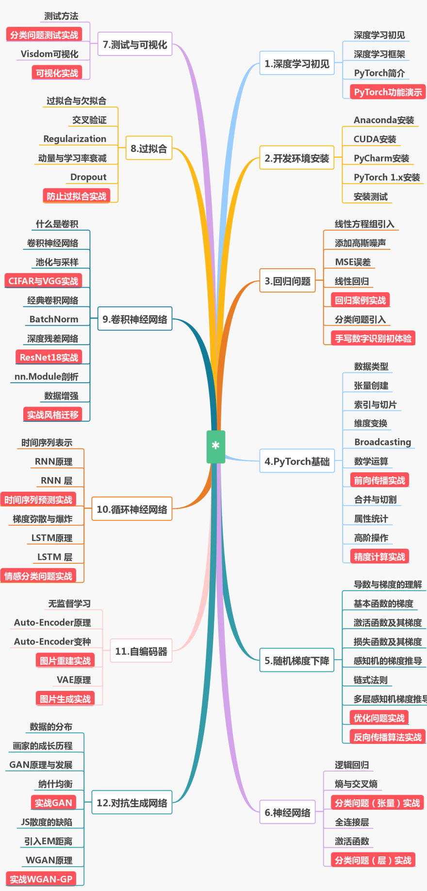

# 本课程学习龙曲良老师的pytorch--正版课程网易云课堂搜索
# 这里将老师上课没有的代码部分补全了
# PyTorch安装指令
请先安装Anaconda和CUDA 10.0。

- 配置国内源

```python
# 配置国内源，方便安装Numpy,Matplotlib等
conda config --add channels https://mirrors.tuna.tsinghua.edu.cn/anaconda/pkgs/free/
conda config --add channels https://mirrors.tuna.tsinghua.edu.cn/anaconda/pkgs/main/
# 配置国内源，安装PyTorch用
conda config --add channels https://mirrors.tuna.tsinghua.edu.cn/anaconda/cloud/pytorch/
# 显示源地址
conda config --set show_channel_urls yes
```

- 安装PyTorch
```python
# 安装PyTorch，要使用国内源请去掉-c pytorch这个参数！！
conda install pytorch torchvision cudatoolkit=10.0

```

- 安装常用库

```python
pip install numpy matplotlib pillow pandas
```
 

 
**课程大纲:**



